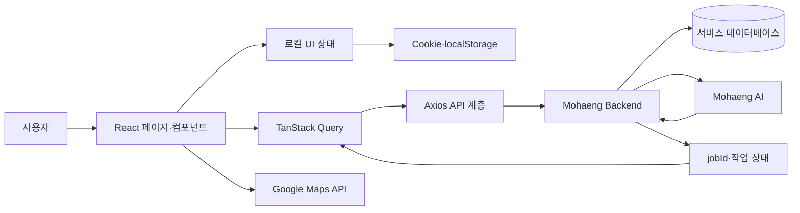

<div align="center">
  

  # 모두의 여행, 모행

  **AI와 함께 여행 일정을 만들고, 기록하고, 공유하는 여행 플랫폼**

  [서비스](https://www.mohaeng.kr/) · [프론트엔드 저장소](https://github.com/SERVICE-MOHAENG/Mohaeng-FE) · [백엔드 저장소](https://github.com/SERVICE-MOHAENG/Mohaeng-BE) · [AI 저장소](https://github.com/SERVICE-MOHAENG/Mohaeng-AI)
</div>

> 모행은 2026년 5월 12일을 끝으로 운영을 종료했습니다. 현재 배포 주소에서는 종료 안내 화면만 제공하며, 이 저장소에서 개발 당시의 코드와 기술적 의사결정을 확인할 수 있습니다.

## 서비스 소개

모행은 여행 계획을 세울 때 반복되는 검색, 비교, 동선 구성의 부담을 줄이기 위해 만든 AI 여행 서비스입니다. 사용자가 여행지, 기간, 동행 유형, 여행 취향을 입력하면 AI가 조건에 맞는 일정을 생성하고, 사용자는 채팅으로 결과를 수정할 수 있습니다. 완성한 일정은 저장하거나 다른 사용자와 공유하고, 여행 후에는 기록으로 남길 수 있습니다.

### 주요 기능

| 기능 | 설명 |
| --- | --- |
| AI 여행 일정 생성 | 여행 조건과 취향을 바탕으로 날짜별 장소와 방문 순서를 생성합니다. |
| 대화형 일정 수정 | “카페를 추가해 줘”와 같은 자연어 요청으로 기존 일정을 수정합니다. |
| 여행지 탐색 | 국가·도시 검색, 추천 여행지, 최근 검색 기록을 제공합니다. |
| 지도와 지구본 | Google Maps로 일정 동선을 확인하고, 3D 지구본으로 방문 국가를 시각화합니다. |
| 여행 기록과 공유 | 여행 일정, 블로그, 좋아요, 방문 국가를 한곳에서 관리합니다. |
| 계정 관리 | 이메일 회원가입과 Google OAuth, 마이페이지, 비밀번호 변경·탈퇴를 지원합니다. |

## 담당 역할과 팀 구성

### 담당 역할

**정명우([@tccmw](https://github.com/tccmw)) · Web Frontend**

- React·TypeScript 기반 웹 프론트엔드 설계와 구현
- 여행 설문부터 AI 일정 생성·대화형 수정까지의 사용자 흐름 개발
- TanStack Query와 Axios 기반 서버 상태·인증 처리
- Google Maps, 3D 지구본, 반응형 UI 구현
- Vercel 배포와 운영 이슈 대응

### 팀 구성

GitHub 조직의 공개 저장소 기여 이력을 기준으로 정리한 개발 팀 구성입니다.

| 분야 | 구성원 | 담당 |
| --- | --- | --- |
| Web Frontend | [정명우](https://github.com/tccmw) | 웹 클라이언트, API 연동, 배포 |
| Mobile Frontend | [박태준](https://github.com/cartooncompany) | Flutter 클라이언트 |
| Backend | [하동건](https://github.com/dongguli08), [이동현](https://github.com/devizi0), [kpj0526_08](https://github.com/kpj0526) | 인증, 여행·블로그 도메인 API, 데이터 저장 |
| AI | [나병현](https://github.com/iamb0ttle), [신용철](https://github.com/zweadfx) | 추천, 일정 생성·수정 AI 파이프라인 |

## 기술 스택과 선정 이유

| 구분 | 기술 | 선정 이유 |
| --- | --- | --- |
| UI | React 19, TypeScript | 컴포넌트 단위로 복잡한 여행 설문과 일정 화면을 나누고, API 응답과 UI 상태의 타입 오류를 줄이기 위해 선택했습니다. |
| 빌드 | Vite 7 | 빠른 개발 서버와 HMR, 간결한 환경 변수·프로덕션 빌드 설정이 필요했습니다. |
| 모노레포 | Nx 22 | 여러 앱과 공용 UI·API 모듈을 한 저장소에서 관리하고 빌드·테스트 단위를 명확히 나누기 위해 사용했습니다. |
| 서버 상태 | TanStack Query 5 | 캐시, 로딩·오류 상태, 재요청 정책을 일관되게 관리하기 위해 도입했습니다. |
| HTTP | Axios | 공개·인증 API 인스턴스를 분리하고 요청·응답 인터셉터에서 토큰과 401 처리를 중앙화했습니다. |
| 라우팅 | React Router 6 | 인증 여부와 여행 생성 단계에 따라 페이지 전환 흐름을 구성했습니다. |
| 스타일 | Tailwind CSS 3 | 반복되는 간격·반응형 규칙을 빠르게 적용하고 페이지 간 스타일 일관성을 유지했습니다. |
| 지도·3D | Google Maps API, Three.js, React Three Fiber, react-globe.gl | 일정의 장소·동선을 지도에 표시하고 방문 국가를 인터랙티브 지구본으로 표현하기 위해 선택했습니다. |
| 모션 | Framer Motion | 랜딩과 로그인 화면의 전환을 선언적으로 구현했습니다. |
| 테스트 | Vitest, Testing Library, Playwright | 컴포넌트·훅 단위 검증과 핵심 사용자 흐름의 E2E 검증을 분리했습니다. |
| 배포 | Vercel | Vite 정적 빌드의 배포와 PR 단위 프리뷰 확인을 자동화했습니다. |

## 주요 문제와 해결 방법

### 1. AI 작업 시간이 길어 응답과 화면 상태가 끊기는 문제

일정 생성과 수정은 AI 처리가 끝날 때까지 시간이 필요해 단일 HTTP 요청으로 기다리면 타임아웃과 중복 요청이 발생했습니다. 요청 즉시 받은 `jobId`를 기준으로 상태 API를 폴링하고, 성공 시 결과 API를 별도로 조회하는 비동기 흐름으로 분리했습니다. `jobId`는 라우터 상태와 `localStorage`에 보존했으며, 진행 중·완료 플래그로 폴링 요청의 중첩을 막았습니다.

- 코드: [홈 추천 작업 폴링](https://github.com/SERVICE-MOHAENG/Mohaeng-FE/blob/main/apps/mohang-app/src/app/pages/HomePage.tsx), [일정 생성·수정 폴링](https://github.com/SERVICE-MOHAENG/Mohaeng-FE/blob/main/apps/mohang-app/src/app/pages/PlanDetailPage/index.tsx)
- PR: [#316 홈 추천 작업 폴링과 jobId 유지](https://github.com/SERVICE-MOHAENG/Mohaeng-FE/pull/316), [#310 일정 수정 중복 전송 방지](https://github.com/SERVICE-MOHAENG/Mohaeng-FE/pull/310)

### 2. 재진입 시 대화 내역이 사라지고 전송 메시지가 중복되는 문제

서버 응답의 여러 채팅 형식을 하나의 메시지 모델로 정규화하고, 서버 기록과 로컬 기록을 함께 복원하도록 구성했습니다. 한글 IME 조합 중 Enter 입력과 처리 중 재전송을 차단하고, 임시 메시지는 작업 결과에 따라 교체해 화면과 서버 상태가 어긋나지 않게 했습니다.

- 코드: [채팅 내역 복원·메시지 전송](https://github.com/SERVICE-MOHAENG/Mohaeng-FE/blob/main/apps/mohang-app/src/app/pages/PlanDetailPage/index.tsx), [채팅 사이드바](https://github.com/SERVICE-MOHAENG/Mohaeng-FE/blob/main/apps/mohang-app/src/app/pages/PlanDetailPage/components/ChatSidebar.tsx)
- PR: [#279 채팅 내역 유지](https://github.com/SERVICE-MOHAENG/Mohaeng-FE/pull/279), [#314 채팅 복원·폴링 오류 수정](https://github.com/SERVICE-MOHAENG/Mohaeng-FE/pull/314)

### 3. 인증 만료 처리가 페이지마다 달라 무한 오류가 발생하는 문제

공개 요청과 인증 요청용 Axios 인스턴스를 분리하고, 인증 요청에는 인터셉터가 토큰을 자동으로 추가하도록 했습니다. 401 응답 시 토큰을 제거하고 로그인 화면으로 한 번만 이동하도록 리다이렉트 잠금 로직을 두었으며, 보호 페이지는 `AuthGuard`로 통일했습니다.

- 코드: [Axios 클라이언트](https://github.com/SERVICE-MOHAENG/Mohaeng-FE/blob/main/libs/ui/src/api/client.ts), [인증 유틸리티](https://github.com/SERVICE-MOHAENG/Mohaeng-FE/blob/main/libs/ui/src/api/authUtils.ts), [AuthGuard](https://github.com/SERVICE-MOHAENG/Mohaeng-FE/blob/main/apps/mohang-app/src/app/components/AuthGuard.tsx)
- PR: [#219 인증 페이지 리다이렉트](https://github.com/SERVICE-MOHAENG/Mohaeng-FE/pull/219), [#307 세션 만료 시 로그인 이동](https://github.com/SERVICE-MOHAENG/Mohaeng-FE/pull/307)

### 4. AI·백엔드·지도 간 장소 데이터 형식이 다른 문제

장소 카테고리 별칭, 좌표의 문자열·숫자 혼용, 누락된 식별자와 표시 값을 화면에서 매번 처리하면 분기와 오류가 늘어났습니다. 경계 계층에서 장소 데이터를 정규화해 일정과 지도 컴포넌트가 하나의 모델만 사용하도록 바꾸고, 알 수 없는 값에는 안전한 대체 값을 적용했습니다.

- 코드: [장소 스키마 정규화](https://github.com/SERVICE-MOHAENG/Mohaeng-FE/blob/main/apps/mohang-app/src/app/utils/placeSchema.ts), [지도 섹션](https://github.com/SERVICE-MOHAENG/Mohaeng-FE/blob/main/apps/mohang-app/src/app/pages/PlanDetailPage/components/MapSection.tsx)
- PR: [#291 장소 카테고리 스키마 통일](https://github.com/SERVICE-MOHAENG/Mohaeng-FE/pull/291)

## 아키텍처와 데이터 흐름



AI 일정 생성·수정 데이터는 다음 순서로 흐릅니다.

1. 사용자가 여행 조건 또는 일정 수정 요청을 입력합니다.
2. 프론트엔드가 백엔드에 작업 생성을 요청하고 `jobId`를 받습니다.
3. 백엔드가 AI 서버에 작업을 위임하는 동안 프론트엔드는 상태 API를 주기적으로 조회합니다.
4. 작업이 완료되면 결과 API에서 일정 데이터를 받아 장소 스키마를 정규화합니다.
5. 정규화한 일정을 사이드바와 Google Maps에 함께 렌더링합니다.

### 저장소 구조

```text
apps/
├─ mohang-app/       # 운영 웹 애플리케이션
├─ mohang-app-e2e/   # Playwright E2E 테스트
├─ mohang/           # 초기 앱
├─ mohang-diary/     # 기능 분리 실험 앱
├─ mohang-my/        # 기능 분리 실험 앱
└─ mohang-planner/   # 기능 분리 실험 앱
libs/
├─ ui/               # 공용 UI, API, 훅, 디자인 토큰
└─ util-config/      # 공용 설정과 전역 스타일
docs/                # 설계 문서와 README 이미지
```

## 실행 방법과 환경 변수

### 요구 환경

- Node.js 20.19 이상
- npm 10 이상
- Google OAuth Client ID
- 지도 화면을 사용할 경우 Google Maps JavaScript API Key
- 실행 가능한 Mohaeng Backend API 주소

### 설치와 실행

```powershell
git clone https://github.com/SERVICE-MOHAENG/Mohaeng-FE.git
cd Mohaeng-FE
npm ci
Copy-Item .env.example .env.local
npx nx serve mohang-app
```

개발 서버는 기본적으로 `http://localhost:4200`에서 실행됩니다.

### 환경 변수

루트의 `.env.local`에 다음 값을 설정합니다. 실제 키와 토큰은 저장소에 커밋하지 않습니다.

```dotenv
VITE_PROD_BASE_URL=https://your-api.example.com
VITE_GOOGLE_CLIENT_ID=your-google-oauth-client-id
VITE_GOOGLE_MAPS_API_KEY=your-google-maps-api-key
```

| 변수 | 필수 | 설명 |
| --- | --- | --- |
| `VITE_PROD_BASE_URL` | 선택 | API 기본 주소입니다. 미설정 시 코드의 운영 API 주소를 사용합니다. |
| `VITE_GOOGLE_CLIENT_ID` | 인증 기능 사용 시 필수 | Google OAuth 클라이언트 ID입니다. |
| `VITE_GOOGLE_MAPS_API_KEY` | 지도 기능 사용 시 필수 | 일정 상세 화면에서 사용하는 Google Maps 키입니다. |
| `VITE_BASE_URL` | 아니요 | 초기 개발 환경 호환을 위해 예시 파일에 남아 있으며, 현재 API 클라이언트는 `VITE_PROD_BASE_URL`을 사용합니다. |

### 빌드와 테스트

```powershell
# 프로덕션 빌드
npx nx build mohang-app

# 단위·컴포넌트 테스트
npx nx test mohang-app

# E2E 테스트
npx nx e2e mohang-app-e2e

# 프로젝트 의존 관계 확인
npx nx graph
```

## 담당 코드와 PR

정명우([@tccmw](https://github.com/tccmw))가 담당한 대표 작업입니다.

| 영역 | 코드 | 대표 PR |
| --- | --- | --- |
| 랜딩·서비스 진입 | [LandingPage.tsx](https://github.com/SERVICE-MOHAENG/Mohaeng-FE/blob/main/apps/mohang-app/src/app/pages/LandingPage.tsx) | [#168 인터랙티브 랜딩 페이지](https://github.com/SERVICE-MOHAENG/Mohaeng-FE/pull/168) |
| 여행 설문·선택 흐름 | [SurveyPage](https://github.com/SERVICE-MOHAENG/Mohaeng-FE/tree/main/apps/mohang-app/src/app/pages/SurveyPage), [TravelSelectionPage](https://github.com/SERVICE-MOHAENG/Mohaeng-FE/tree/main/apps/mohang-app/src/app/pages/TravelSelectionPage) | [#193 여행 설문 UI](https://github.com/SERVICE-MOHAENG/Mohaeng-FE/pull/193), [#247 여행지 선택 UX](https://github.com/SERVICE-MOHAENG/Mohaeng-FE/pull/247) |
| AI 일정 생성·채팅 수정 | [PlanDetailPage](https://github.com/SERVICE-MOHAENG/Mohaeng-FE/tree/main/apps/mohang-app/src/app/pages/PlanDetailPage) | [#279 채팅 내역 유지](https://github.com/SERVICE-MOHAENG/Mohaeng-FE/pull/279), [#310 중복 요청 처리](https://github.com/SERVICE-MOHAENG/Mohaeng-FE/pull/310) |
| 홈·3D 지구본 | [HomePage.tsx](https://github.com/SERVICE-MOHAENG/Mohaeng-FE/blob/main/apps/mohang-app/src/app/pages/HomePage.tsx), [Globe.tsx](https://github.com/SERVICE-MOHAENG/Mohaeng-FE/blob/main/libs/ui/src/lib/Globe.tsx) | [#229 최근 여행 표시](https://github.com/SERVICE-MOHAENG/Mohaeng-FE/pull/229), [#257 방문 국가 마커](https://github.com/SERVICE-MOHAENG/Mohaeng-FE/pull/257) |
| 여행 블로그 | [BlogListPage.tsx](https://github.com/SERVICE-MOHAENG/Mohaeng-FE/blob/main/apps/mohang-app/src/app/pages/BlogListPage.tsx), [FeedGrid.tsx](https://github.com/SERVICE-MOHAENG/Mohaeng-FE/blob/main/libs/ui/src/lib/FeedGrid.tsx) | [#289 블로그 전체 목록](https://github.com/SERVICE-MOHAENG/Mohaeng-FE/pull/289) |
| 인증·세션 | [client.ts](https://github.com/SERVICE-MOHAENG/Mohaeng-FE/blob/main/libs/ui/src/api/client.ts), [AuthGuard.tsx](https://github.com/SERVICE-MOHAENG/Mohaeng-FE/blob/main/apps/mohang-app/src/app/components/AuthGuard.tsx) | [#219 인증 가드](https://github.com/SERVICE-MOHAENG/Mohaeng-FE/pull/219), [#307 세션 만료 처리](https://github.com/SERVICE-MOHAENG/Mohaeng-FE/pull/307) |

전체 작업 내역은 [@tccmw가 작성한 PR 목록](https://github.com/SERVICE-MOHAENG/Mohaeng-FE/pulls?q=is%3Apr+author%3Atccmw)에서 확인할 수 있습니다.

---

문의: [SERVICE-MOHAENG GitHub 조직](https://github.com/SERVICE-MOHAENG)
